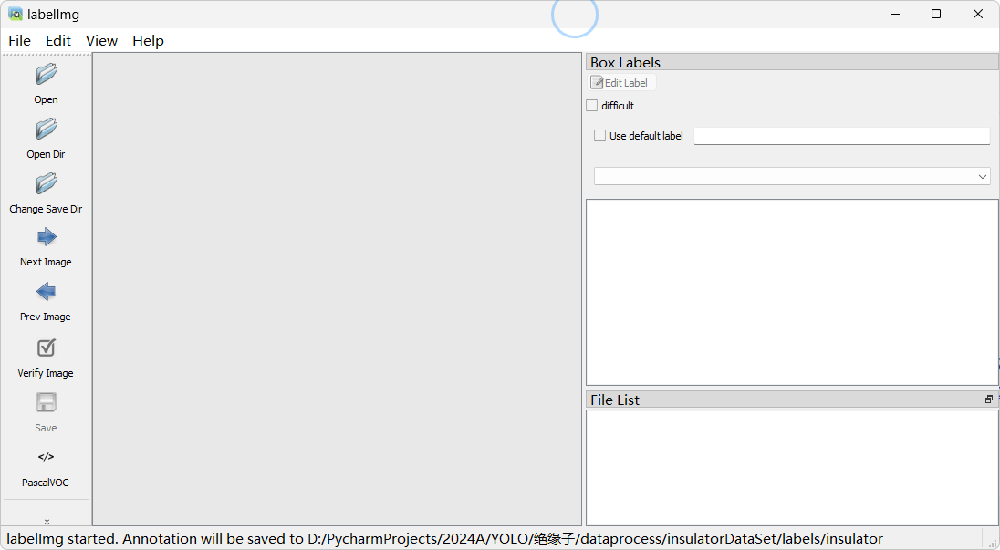

# Here is a Loopy！

某天心血来潮，想用YOLO模型做一个识别Loopy的模型，于是就有了这个项目。

## 关于环境

### 1 首先安装所需库（10分钟）

在项目命令行运行：`pip install -r requirements.txt`

### 2 使用GPU（选做）（30分钟）

想使用GPU，需要安装上述库后，卸载torch然后重装GPU版本（不要与1弄反，否则还是会被cpu版本替换）

卸载：`pip uninstall torch,torchvision`，然后一定要留意被卸载的torch，torchvision的版本！

CUDA：一般选111、117、121，这几个版本torch比较全。

whl下载：建议在网站[Links for torch (tsinghua.edu.cn)](https://pypi.tuna.tsinghua.edu.cn/simple/torch/)寻找torch，搜索torch-2.1.0+cu121-cp310-cp310-win，其中"2.1.0"替换刚卸载的版本，“121”替换CUDA版本，“310”替换python版本，点击下载。在网站[download.pytorch.org/whl/torchvision/](https://download.pytorch.org/whl/torchvision/)寻找torchvision，同理搜索到对应版本。

重装：在项目命令行运行：`pip install "……/torch…….whl"（下载路径）`

## 关于数据集(选做）

### 1 数据说明

源数据在`/dataprocess/Data`，`images`是图像文件，`labels`是标注文件，格式为xml。

### 2 使用labelimg标注（每张10秒）

命令行输入`labelimg`，应出现以下窗口：

`Open Dir`：打开图像所在文件夹

`Change Save Dir`：打开标注文件所在文件夹

其他操作：略，很好上手

### 3 文件转换（1分钟）

标注文件为xml，而YOLO所需的标注文件为txt，且需划分训练集`train`、验证集`val`，故有文件`xml2YOLO.py`。

无新标注文件略过即可

## 关于训练与预测

### 1 训练配置

配置文件在`YOLO/loopy.yaml`

### 2 训练

运行`detect.py`，epochs训练轮数可自定义

### 3 预测

训练所得模型在`runs/detect/train/weights/`，后缀.pt

使用代码加载后可预测：图像or视频or摄像头
